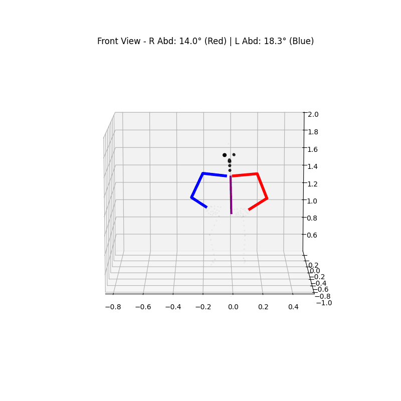
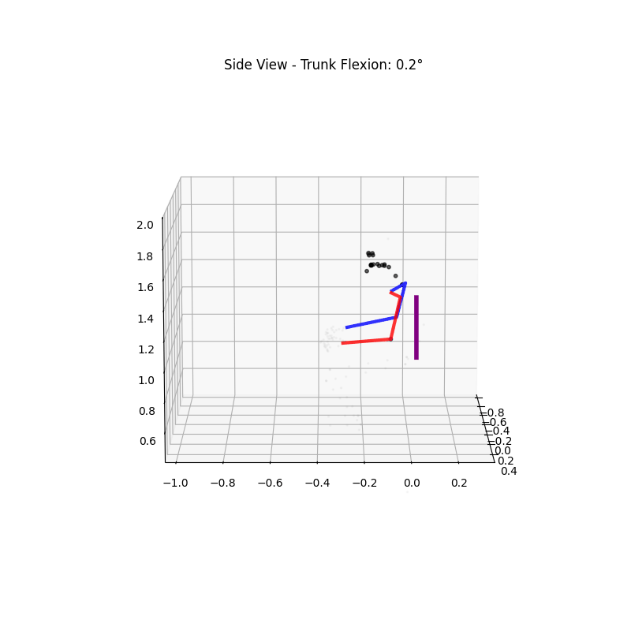

## 🛠️ Project Overview
* **Target Population**: Stroke survivors performing reach-to-grasp and drinking tasks.
* **Technology**: SAM3D for 3D landmark extraction from video.
This repository contains de-identified kinematic data and visualizations. We utilize AI and computer vision to assess movement patterns in stroke survivors, specifically focusing on the biomechanics of drinking activities. Landmarks were extracted using SAM 3D implementation: https://github.com/facebookresearch/sam-3d-body

## 📊 Visualization Demo

Below is a side-by-side comparison of the 3D landmark extraction using SAM3D. The visualization highlights the spine (Purple), physical right arm (Red), and physical left arm (Blue).

| Front View | Side View |
| :---: | :---: |
|  |  |

## 📂 Data Structure
To comply with repository size limits, this repo contains **lightweight landmark files** (`_landmarks_only.pkl`). To find the corresponding indices for each body landmark, please refer to the "pred_joint_coords.json".
